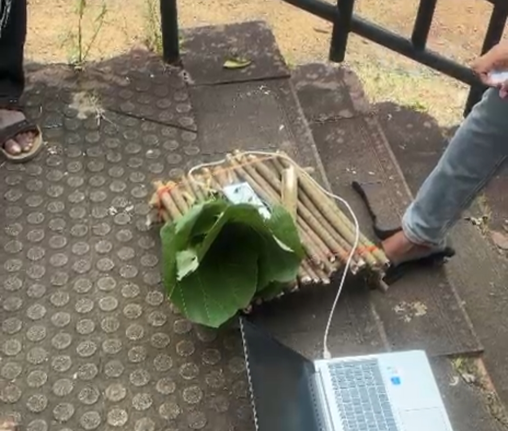

# Gramophone of jungle

## Basic Details
### Team Name: Christy Basil Anil's Team 

### Team Members
- Team Lead: Christy Basil Anil— St.Thomas College, Ranni

  
### Project Description
What if our ancestors skipped the invention of modern technology and went straight to vintage music?
Imagine walking through an ancient jungle and suddenly hearing music coming from a suspiciously advanced wooden box.

### The Problem (that doesn't exist)
Ancient humans had no Wi-Fi.
No electricity.
No Spotify.
And, most importantly… NO GRAMOPHONE.

For thousands of years, our ancestors were forced to live without listening to music on a giant spinning disc.
Honestly, unacceptable.

### The Solution (that nobody asked for)
As a responsible descendant with zero respect for historical accuracy, I decided to fix this massive injustice.

I built a gramophone for ancient jungle people.

Because if our ancestors could discover fire, invent tools, and survive wild animals, surely they deserved to sit around a campfire and enjoy some ancient lo-fi beats.

Did they need it? No.
Did they ask for it? Absolutely not.
Did I build it anyway? Obviously. 🗿

## Technical Details
### Components Used

For Hardware:
- [List main components]
- [List specifications]
- [List tools required]

### Implementation
For Software:
# Installation
[commands]

# Run
[commands]

### Project Documentation
For Software:

# Screenshots (Add at least 3)

*Add caption explaining what this shows*

*Add caption explaining what this shows*

*Add caption explaining what this shows*

# Diagrams

*Add caption explaining your workflow*

For Hardware:

# Schematic & Circuit

*Add caption explaining connections*

*Add caption explaining the schematic*

# Build Photos

*List out all components shown*

*Explain the build steps*

*Explain the final build*

### Project Demo
# Video
[Add your demo video link here]
*Explain what the video demonstrates*

# Additional Demos
[Add any extra demo materials/links]

## Team Contributions
- [Name 1]: [Specific contributions]
- [Name 2]: [Specific contributions]
- [Name 3]: [Specific contributions]

---
Made with ❤️ at TinkerHub Useless Projects 

